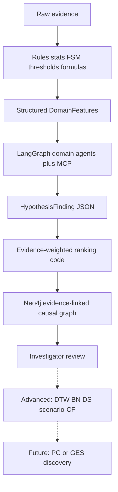

# TRACE Model Architecture Review

Verdict: the **three-model taxonomy** (stats/ML vs LLM vs probabilistic) and **“ML feeds LLM, doesn’t replace it”** principle are the strongest parts. The weak parts are mostly **scope inflation** (Future/Advanced work pulled into the default path), **population ML on accident-only FRA/RAIB data**, and **paid Claude-first** choices that fight the blueprint’s free/simple + evidence-first rules.

Current repo context: Phase 1–2 already has affine clock correction (`[backend/app/core/temporal/engine.py](backend/app/core/temporal/engine.py)`), YAML rule anomalies including signal transitions (`[backend/app/core/anomalies/rules/railway_rules.yaml](backend/app/core/anomalies/rules/railway_rules.yaml)`), and conflict detection. Phase 3 domain scorers, MCP evidence tools, bounded agents, HypothesisFinding persistence, and findings/hypotheses UI are implemented (see `docs/updates.txt` Iteration 5–6). Phase 4 Neo4j is not built yet. Blueprint (`[docs/_blueprint_extract.txt](docs/_blueprint_extract.txt)`) scopes PC/GES to **Future**, BN/DoWhy/DS/DTW to **Advanced**, and requires local/free LLM fallback.

---

## What’s excellent (keep)

1. **Category split** — Treating temporal/stats, LLM reasoning, and PGMs as different tool classes prevents “everything is an LLM” and “everything is an ML model” mistakes. Aligns with blueprint: *deterministic evidence processing precedes LLM reasoning*; *LLM confidence ≠ Bayesian probability*.
2. **Preprocessor → agent flow** — Domain scorers produce quantitative features; LLM synthesizes `HypothesisFinding` with support/contradict/missing lists. Correct division of labor.
3. **Formulaic fatigue / curve-fit track / threshold weather** — Deterministic, interpretable, auditable. Matches *simple first*. Three-Process alertness and QI exponential fit are strong *when inputs exist*.
4. **Signal FSM / rule replay** — Same spirit as existing `invalid_signal_transition` rules. Formal FSM is a natural upgrade of what you already ship.
5. **Bounded ReAct + structured output with `reasoning` first** — Matches blueprint (3–5 iterations, Pydantic/JSON findings). Putting reasoning before conclusions reduces schema/commitment errors.
6. **n-gram fallback when LSTM data is scarce** — Correct instinct that neural sequence models are data-hungry; for TRACE, scarcity is the default.

---

## What’s weak (and better alternatives)

### Layer 2 — Temporal

| Proposal                          | Issue                                                                                        | Better alternative                                                                                                                                      |
| --------------------------------- | -------------------------------------------------------------------------------------------- | ------------------------------------------------------------------------------------------------------------------------------------------------------- |
| Fresh `linregress` clock drift    | Fine in principle; **already done** via `np.polyfit` affine fit on anchors                   | Keep current affine engine; add SciPy OLS only if you need CI/residuals for confidence. Don’t rebuild.                                                  |
| Isolation Forest on event streams | Per-case streams are short; unsupervised IF needs tuning and is hard to explain forensically | Stay with **rules + interval heuristics** (gap spikes, impossible order, frequency vs source baseline). IF only if you later have large normal corpora. |
| PELT (`ruptures`) on loco signals | Good Advanced idea; needs dense continuous series TRACE may not always ingest                | Gate behind **Advanced + continuous telemetry present**. MVP already has speed threshold rules.                                                         |
| DTW                               | Correctly not “a model”; blueprint already marks Advanced                                    | Keep as Phase 6; discrete events use nearest-time/anchor matching (already intended).                                                                   |

### Layer 3A — Domain ML preprocessors

| Proposal                             | Issue                                                                                                                                                                | Better alternative                                                                                                                                                                                  |
| ------------------------------------ | -------------------------------------------------------------------------------------------------------------------------------------------------------------------- | --------------------------------------------------------------------------------------------------------------------------------------------------------------------------------------------------- |
| Full Three-Process Model             | Needs last-sleep end + duration — often **missing** from railway packets                                                                                             | Implement **degraded alertness**: (1) hours-of-service vs regulation, (2) circadian C(t) from time-of-day, (3) full TPM only when sleep fields exist. Always emit `inputs_used` / `missing_inputs`. |
| Behavioral variance in last 15 min   | Good, but “low variance + low alertness = fatigue” is one hypothesis among several (autopilot, flat track, ATC)                                                      | Emit features separately; let LLM argue causation. Don’t hard-code the conjunction as a fatigue verdict.                                                                                            |
| LSTM autoencoder on signal sequences | Overfit risk, needs “normal” FRA/RAIB sequences that don’t match this interlocking; heavy PyTorch dep                                                                | **Do not build.** Use FSM violations + optional n-gram **only if** you have same-system normal logs.                                                                                                |
| `transitions` FSM library            | Reasonable, but you already encode forbidden transitions in YAML                                                                                                     | Extend YAML/rule engine first; adopt `transitions` only if multi-condition interlocking gets too complex for rules.                                                                                 |
| QI exponential `curve_fit`           | Good when QI series exists; many cases have sparse/no QI                                                                                                             | Same pattern as fatigue: thresholds + overdue maintenance flags when curve can’t be fit.                                                                                                            |
| Weather RF on FRA severity           | Confuses **predicting accident severity in a population** with **contribution in this case**; FRA weather fields are coarse; all rows are accidents → selection bias | Keep **threshold composite score**. Skip RF for MVP/Advanced unless you build a proper case-control set. Feature importance from RF ≠ causal attribution for the report.                            |

### Layer 3B — LLMs

| Proposal                                   | Issue                                                                         | Better alternative                                                                                                                                                     |
| ------------------------------------------ | ----------------------------------------------------------------------------- | ---------------------------------------------------------------------------------------------------------------------------------------------------------------------- |
| Claude Sonnet/Opus as default              | Violates blueprint cost/privacy policy (*no core feature requires paid API*)  | **Provider-agnostic agent layer**: local model (Ollama/vLLM, OpenAI-compatible) as default path; Claude/GPT as optional `LLM_PROVIDER`. Same prompts/schemas for both. |
| Opus only for meta-agent                   | Meta-arbitration should be mostly **deterministic scoring** + short synthesis | MVP: evidence-weighted ranking (blueprint dims) in code; meta-LLM writes narrative + flags conflicts. Upgrade model tier only if arbitration quality fails eval.       |
| Full DS → BN → DoWhy after every agent run | Pulls Advanced/Future into the hot path before MVP agents work                | Phase 3 ends at **HypothesisFinding + weighted rank**. Graph next. BN/DS/DoWhy only after one synthetic E2E case succeeds (blueprint gate).                            |

### Layer 4 — Causal

| Proposal                                       | Issue                                                                                                                                                                      | Better alternative                                                                                                                                                                                                    |
| ---------------------------------------------- | -------------------------------------------------------------------------------------------------------------------------------------------------------------------------- | --------------------------------------------------------------------------------------------------------------------------------------------------------------------------------------------------------------------- |
| PC on FRA binary flags + `accident_occurred`   | Blueprint: causal discovery = **Future**. Matrix of accidents-only makes outcome column vacuous; flags are investigator-dependent; CI tests ≠ forensic DAG for *this* case | **Phase 4 MVP:** hand-authored domain causal templates → Neo4j edges **only when agents cite evidence**. Path tracing + evidence links.                                                                               |
| BN VariableElimination for “formal confidence” | Useful Advanced, but CPTs from FRA frequencies ≠ this interlocking/this duty                                                                                               | Expert/template CPTs + case observations; keep BN posterior **separate** from agent `confidence` (already a TRACE principle).                                                                                         |
| DoWhy ATE / propensity on historical accidents | Identification assumptions fail on accident-only observational data; weak for single-case forensics                                                                        | Prefer blueprint-style **scenario counterfactuals**: intervene on timeline/events (e.g. brake T−5s) via simple kinematic/rules sim, or later a small SCM — label as *model-based counterfactual evidence*, not proof. |
| Dempster-Shafer in default pipeline            | Blueprint: only after weighted scoring validated                                                                                                                           | Weighted score first; DS as Advanced conflict combinator.                                                                                                                                                             |

---

## Recommended architecture (concrete default)

**Ship with Phase 3**

- MCP read tools as blueprint lists
- Four agents + meta synthesizer (LangGraph, max 5 loops)
- Domain preprocessors: degraded alertness, signal FSM/rules, maintenance/QI-or-overdue, weather thresholds + optional loco behavioral stats
- Local-first LLM + optional Claude
- Ranking: evidence support, temporal consistency, source reliability, completeness, contradiction penalty — **not** BN posteriors

**Phase 4**

- Neo4j nodes/edges from findings + events; every `CAUSES`/`CONTRIBUTES_TO` carries evidence refs

**Advanced (after E2E synthetic gate)**

- DTW for continuous signals; pgmpy BN on fixed template DAG; scenario counterfactuals; then DS

**Future research**

- PC/GES / population causal discovery — never the sole source of case edges

---

## Fixes to the written research doc

1. Move LSTM, Isolation Forest, FRA Random Forest, PC discovery, and default DoWhy ATE out of the “what TRACE uses” table into **Advanced/Future** with data prerequisites.
2. Replace Claude-mandatory with **pluggable LLM** + local fallback.
3. Add **missing-input degradation** for fatigue and track models.
4. Replace population ATE counterfactuals with **case scenario interventions** for TRACE’s forensic use case.
5. Align pipeline order with blueprint phases so Phase 3 isn’t blocked on pgmpy/DoWhy.

this is an architecture decision record for next-phase planning.